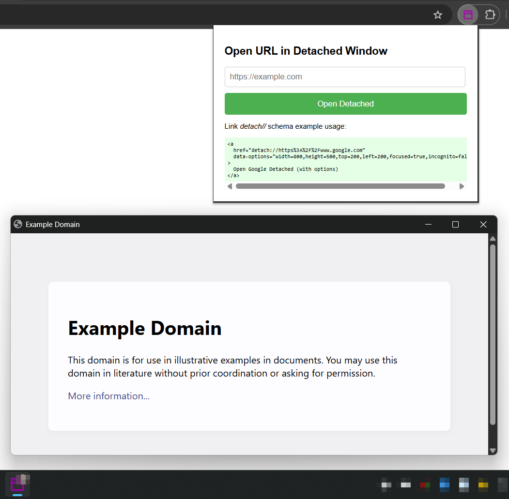

# detached-popup

### **Detached URL Opener** ~ Google Chrome Browser Extension

_By [@xthukuh](https://github.com/xthukuh)_

#

Opens URL in a detached chrome window and an icon shown on the taskbar. The detached window popup has no address bar unlike `window.open` popup windows.

You can trigger the extension to open a window in detached mode using `chrome.runtime.sendMessage`.

```ts
// interface extends CreateType - https://developer.chrome.com/docs/extensions/reference/api/windows#type-CreateType
interface IOpenDetachedWindowMessage extends CreateType {
  action: 'openDetachedWindow';
  url: string;
  width?: number; // px default: 1200
  height?: number; // px default: 700
  left?: number; // default: undefined
  top?: number; // default: undefined
  focused?: boolean; // default: true
  incognito?: boolean; // default: false
}

// send message example
chrome.runtime.sendMessage({ action: "openDetachedWindow", url: 'https://example.com' }, function(response) {
  if (response && response.status === "success") {
    console.log("Detached window opened successfully!");
    window.close(); // Close the popup after sending the message
  } else {
    console.error("Failed to open detached window:", response ? response.message : "Unknown error");
  }
});
```

Opens URLs from 'detach://' links in a detached, address-bar-less window.

```html
<a href="detach://https%3A%2F%2Fwww.google.com">Open Google Detached</a>
<a id="example.com" href="">Open example.com in Detached</a>
<script>
  document.getElementById('example.com').href = 'detach://' + encodeURIComponent('https://example.com');
</script>
```

## Preview

